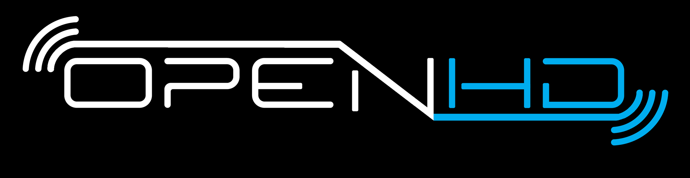

//***********************************************
//***************** SETTINGS ********************
//***********************************************

:doctype: book
:use-link-attrs:
:linkattrs:

// -- Table of Contents

:toc:
:toclevels: 3
:toc-title: 
:toc-placement!:

// -- Icons

ifdef::env-github[]

:caution-caption: :fire:
:important-caption: :exclamation:
:note-caption: :paperclip:
:tip-caption: :bulb:
:warning-caption: :warning:
endif::[]

ifdef::env-github[]
:status:
:outfilesuffix: .asciidoc
endif::[]

:sectanchors:
:numbered:

//************* END OF SETTINGS ******************
//************************************************

// Variables \\
:cloudsmith: link:https://cloudsmith.com[Cloudsmith^]
:digitalocean: link:https://www.digitalocean.com?utm_medium=opensource&utm_source=OpenHD[DigitalOcean^]
:discord: link:https://discord.gg/NRRn5ugrxH[Discord^]
:forum: link:https://forum.openhdfpv.org[OpenHD Forum^]
:imageBuilder: link:https://github.com/OpenHD/OpenHD-ImageBuilder[Image Builder^]
:linux-kernel: link:https://www.kernel.org/doc/html/v4.16/process/license-rules.html[Linux Kernel^]
:openhd: link:https://github.com/OpenHD/OpenHD[OpenHD^]
:raspbian: link:https://www.raspberrypi.org/documentation/[Raspbian^]
:var_QOpenHD_url: link:https://github.com/OpenHD/QOpenHD[QOpenHD^]
:telegram: link:https://t.me/OpenHD_User[Telegram,role=external,window=_blank]
:wiki: link:https://openhd.gitbook.io/open-hd/[Wiki^]

// === BEGIN OF CONTENT === \\
++++

++++

// Logo

// Badges

:telegram_badge: https://img.shields.io/badge/Telegram-Join_us!-informational?logo=Telegram&style=flat-square
:discord_badge: https://img.shields.io/badge/Discord-Join_us!-informational?logo=Discord&style=flat-square
:facebook_badge: https://img.shields.io/badge/Facebook-Join_us!-informational?logo=Facebook&style=flat-square
:github_commit_activity_badge: https://img.shields.io/github/commit-activity/m/OpenHD/OpenHD?style=flat-square
:github_issues_badge: https://img.shields.io/github/issues-raw/OpenHD/OpenHD?style=flat-square
:github_releases_badge: https://img.shields.io/github/downloads/OpenHD/OpenHD/total?style=flat-square
:github_repo_size_badge: https://img.shields.io/github/repo-size/OpenHD/OpenHD?style=flat-square
:github_license_badge: https://img.shields.io/github/license/OpenHD/OpenHD?style=flat-square
:opencollective_members_badge: https://img.shields.io/opencollective/tier/openhd/18297?label=%5Bopencollective%5D%20monthly%20backers&style=flat-square
:opencollective_sponsors_badge: https://img.shields.io/opencollective/sponsors/openhd?label=%5Bopencollective%5D%20sponsors&style=flat-square
:cloudsmith_badge: https://img.shields.io/badge/OSS%20hosting%20by-cloudsmith-blue?logo=cloudsmith&style=flat-square
:digitalocean_badge: https://img.shields.io/badge/Supported%20by-DigitalOcean-blue?logo=digitalocean&style=flat-square

image:{telegram_badge}[Telegram, link="https://t.me/OpenHD_User"]
image:{discord_badge}[Discord, link="https://discord.gg/NRRn5ugrxH"]
image:{facebook_badge}[Facebook, link="https://www.facebook.com/groups/open.hd/"]
image:{github_commit_activity_badge}[GitHub commit activity, link=""]
image:{github_issues_badge}[GitHub issues, link="https://github.com/OpenHD/OpenHD/issues"]
image:{github_releases_badge}[GitHub All Releases, link=""]
image:{github_repo_size_badge}[GitHub repo size, link=""]
image:{github_license_badge}[GitHub License, link="LICENSE"]
image:{opencollective_members_badge}[Open Collective members by tier^, link="https://opencollective.com/openhd"]
image:{opencollective_sponsors_badge}[Open Collective sponsors^, link="https://opencollective.com/openhd"]
image:{cloudsmith_badge}[Cloudsmith, link="https://cloudsmith.io"]
image:{digitalocean_badge}[DigitalOcean, link="https://www.digitalocean.com?utm_medium=opensource&utm_source=OpenHD"]
 
---

// Table of Contents
toc::[]

++++

++++

== Welcome to OpenHD!

OpenHD uses off-the-shelf Wi-Fi adapters available for purchase online. However, it is not standard Wi-Fi, which is unsuitable for low-latency
or very long-distance transmission. Instead, OpenHD configures the Wi-Fi adapter in a way that is closer to a simple broadcast, much like analog
video transmission hardware you may be using already.

High-definition video, 2-way UAV telemetry, audio, and RC control signals can all be sent over a single transmission channel.

A multi-platform OpenHD app is available for live video with a customizable OSD.

ifdef::env-github[]
image:https://1945119839-files.gitbook.io/~/files/v0/b/gitbook-x-prod.appspot.com/o/spaces%2F8RIMU39m4Gt1vqzzt4lm%2Fuploads%2Fgit-blob-353dff94866ae2d4a81fa3329bf93290a0271b42%2FNorbertScreenshot.png?alt=media[link=https://youtube.com/watch?v=5Ht9P3uv5N4]
endif::[]

ifndef::env-github[]
video::5Ht9P3uv5N4[youtube]
endif::[]

TIP: Look around, read the {wiki}, ask questions on {telegram} or {discord}!

== Structure

This repository is one of the following which forms the foundation of the project:

[options="header"]
[cols="1, 5"]
|===
| Name | Description

| {wiki}
| The documentation of this project.

| {openhd}
| The core functionality.

| {imageBuilder}
| The Image Builder preinstalls the OpenHD packages on a ready-to-use image.

| {var_QOpenHD_url}
| The default ground control aplication (Video, OSD, MAVLINK settings).

|===

== License

OpenHD and its images are licensed under GPL v3.0, unless stated otherwise by a submodule's license.
This does not include the OpenHD logos and it's brand.

== Credits

Befinitiv - original wifibroadcast, Rangarid - OSD, Rodizio - EZ-WifiBroadcast, SVP-COM, Dino.de, Jelle, Vitaliy, and many others.

== Community
Feel free to join our growing community.

We have a {forum}, public {telegram} and {discord} group with members helping each other. Additionally we started a {facebook} group

If you just want to see when new releases are announced, you can star this repository on Github 

== Developers
Contribution is always welcome!
Start helping us by open up an issue or pull request.
We recommend getting in touch with us via the {telegram} group or the {discord} server.

*Thanks to all the people who already contributed!*

[#img-contributors,link=https://github.com/OpenHD/OpenHD/graphs/contributors]
image::https://openhd-images.fra1.cdn.digitaloceanspaces.com/uploads/OpenHD.svg[Contributors]

== Special Thanks

image:https://img.shields.io/badge/OSS%20hosting%20by-cloudsmith-blue?logo=cloudsmith&style=for-the-badge[title="Cloudsmith", link="https://cloudsmith.com"]

Package repository hosting is graciously provided by {cloudsmith}.
Cloudsmith is the only fully hosted, cloud-native, universal package management solution, that
enables your organization to create, store and share packages in any format, to any place, with total
confidence.

---

//image:https://img.shields.io/badge/Sponsorship%20by-DigitalOcean-blueviolet?logo=digitalocean&style=for-the-badge[title="DigitalOcean", link="https://www.digitalocean.com?utm_medium=opensource&utm_source=OpenHD"]
image:https://opensource.nyc3.cdn.digitaloceanspaces.com/attribution/assets/PoweredByDO/DO_Powered_by_Badge_blue.svg[title="DigitalOcean", link="https://www.digitalocean.com?utm_medium=opensource&utm_source=OpenHD", height=50px]

We are grateful to have the generous support of {DigitalOcean} for this project. As a cloud computing platform, DigitalOcean provides developers and businesses with powerful infrastructure and tools to deploy, manage, and scale their applications with ease.

== Logotype

OpenHD logo was designed by link:https://kurtzgraphics.com/[KURTZ]

== Warranty/Disclaimer

This is free software and comes with no warranty, as stated in parts 11 and 12 of the GPLv2 license.
The creators and contributors of the software are not responsible for how it is used.

